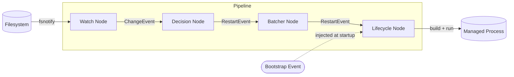

# GoCrane


GoCrane is a tool to help run and automatically rebuild applications in a `Docker` environment.

Key features:

* Verbose logging to help troubleshoot issues
* Newly created directories are automatically added to the watch list, including nested ones
* Configurable build and run arguments
* All flags can also be set via environment variables, reducing command-line clutter
* Capable of skipping initial builds via digest-based caching
* Configurable event batching to avoid excessive rebuilds during bulk file changes
* Files that should only trigger a restart (not a rebuild) can be configured separately

**WARNING:** This project is still young and is subject to breaking changes. Your best choice is to use the versioned [Docker images](https://hub.docker.com/r/mokiat/gocrane/tags) and not `latest`.

## User's Guide

Understanding how GoCrane handles paths will help you configure it correctly and avoid unexpected behavior.

Many flags accept a mix of directory paths, file paths, and glob patterns. Check each flag's documentation to see which are accepted.

GoCrane normalizes all paths to absolute form. If a path cannot be resolved, GoCrane reports an error. Avoid symbolic links — they can produce multiple representations of the same path, leading to undefined behavior.

Glob patterns are distinguished from plain paths by a `*/` prefix. Globs match against individual path segments only: `*/*data` (any file or directory whose name ends in `data`) is valid, but `*/hello/world` is not.

The most important flags are described below. For a full list including aliases and environment variable names, run `gocrane --help`.

* `dir` — Directory to watch (repeatable). GoCrane watches all subdirectories recursively. Files should not be specified here. A glob may be used, though its main purpose in this flag is to re-include subdirectories that `dir-exclude` would otherwise exclude. All other flags are scoped to the directories specified here. Default: `./`.

* `dir-exclude` — Directory or glob pattern to exclude from watching (repeatable). Useful for subdirectories you never want evaluated, such as `.git`. Specifying this flag **replaces** the defaults, so you will need to re-list them if needed. Default: `*/.git`, `*/.github`, `*/.gitlab`, `*/.vscode`. Note: an explicit `dir` entry always takes precedence over any exclusion.

* `source` — File or glob pattern identifying source files (repeatable). Changes to source files trigger a rebuild followed by a restart. Source files are also used to compute the digest for cache comparison. Default: `*/*.go`, `*/go.mod`, `*/go.sum`. Add non-Go files here if your build uses file embedding.

* `source-exclude` — File or glob pattern for files that should not be treated as source, even if they match `source` (repeatable). Default: `*/*_test.go`.

* `resource` — File or glob pattern identifying resource files (repeatable). Changes to resources trigger a restart but **not** a rebuild. Useful for configuration files read by your application at startup. Default: none.

* `resource-exclude` — File or glob pattern for files that should not be treated as resources, even if they match `resource` (repeatable). Specifying this flag **replaces** the defaults. Default: `*/.gitignore`, `*/.gitattributes`, `*/.DS_Store`, `*/README.md`, `*/LICENSE`, `*/Dockerfile`, `*/docker-compose.yml`.

* `main` — Directory containing the main package to build. Default: `./`.

* `binary` — Path to a pre-built executable to use on startup instead of rebuilding. Only meaningful when the binary was produced by `gocrane build`, which also writes a `<binary>.dig` digest file. If the digest matches the current source files, GoCrane skips the initial build and runs the cached binary directly. On a mismatch it falls back to a full rebuild.

### Using with Docker Compose

The primary use case for GoCrane is inside a Docker or Docker Compose environment. The included [example](https://github.com/mokiat/gocrane/tree/master/example) shows how to set this up so that changes on your host machine are detected inside the container.

**Note:** To exercise the caching behavior, run `docker compose build --no-cache example` once you are happy with your changes to the example. Subsequent `docker compose up` runs will skip the initial build until source files change on the host.

### Using locally

To use the tool locally, you can get it as follows (Go 1.26+):

```sh
go install github.com/mokiat/gocrane@latest
```

Normally, it would be sufficient to run `gocrane run` in the root folder of your project. If the `main` package is not located in the root folder (e.g. in `./cmd/executable/`), you would need to use the `main` flag to specify that.

For more information, consult `gocrane --help`.

## Developer's Guide

GoCrane's runtime logic is organized as a **pipeline of concurrent nodes** connected by typed event queues. Each node runs in its own goroutine and communicates exclusively through channels — there is no shared mutable state between nodes. All goroutines are coordinated via an `errgroup` with a shared context; if any node returns an error or the top-level context is cancelled, the whole pipeline shuts down.

### Events

Two event types flow through the pipeline:

- **`ChangeEvent`** — carries the path of a file or directory that changed on the filesystem.
- **`RestartEvent`** — signals that the application should be restarted, with a `ShouldRebuild` flag distinguishing a full rebuild (source change) from a restart-only (resource change).

### Pipeline



**Watch Node** — subscribes to the filesystem via `fsnotify` and emits a `ChangeEvent` for each relevant file-system notification. It automatically adds newly-created directories to the watch list and removes deleted ones, keeping recursive watching consistent without restarts.

**Decision Node** — classifies each `ChangeEvent` by its path. Source file changes emit a `RestartEvent{ShouldRebuild: true}`; resource file changes emit a `RestartEvent{ShouldRebuild: false}`; all other paths are silently dropped.

**Batcher Node** — debounces incoming `RestartEvent`s using a configurable timer. While the timer is running, events accumulate (a single rebuild request supersedes a restart-only request). Once the timer fires with no new arrivals, one merged event is flushed downstream. This prevents excessive builds during bulk file operations such as branch switches or file fetches.

**Lifecycle Node** — drives the application's actual lifecycle. On a `RestartEvent{ShouldRebuild: true}` it invokes `go build`, stops the running process, and starts the new binary. On a `RestartEvent{ShouldRebuild: false}` it skips the build and restarts with the existing binary. If a build fails, the old process is intentionally kept running until the next successful build.

### Bootstrap

At startup, a bootstrap `RestartEvent` is injected directly into the Lifecycle Node's input queue — bypassing the Watch, Decision, and Batcher nodes entirely. If a pre-built cached binary is found whose source digest matches the current source files, the event requests a run-only; otherwise it requests a full rebuild.

### Queues

Inter-node communication uses the `Queue[T]` type — a thin generic wrapper around a buffered channel. Its `Push` and `Pop` methods are context-aware: both return `false` when the context is cancelled, which is how each node knows to stop its loop and return cleanly, without any explicit channel closing.
